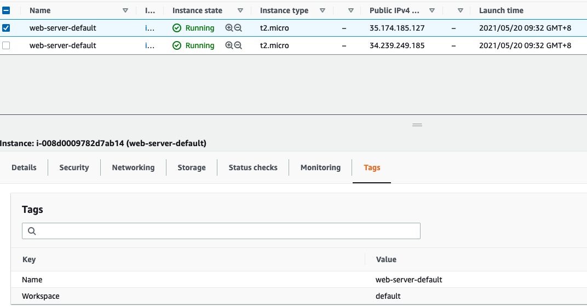
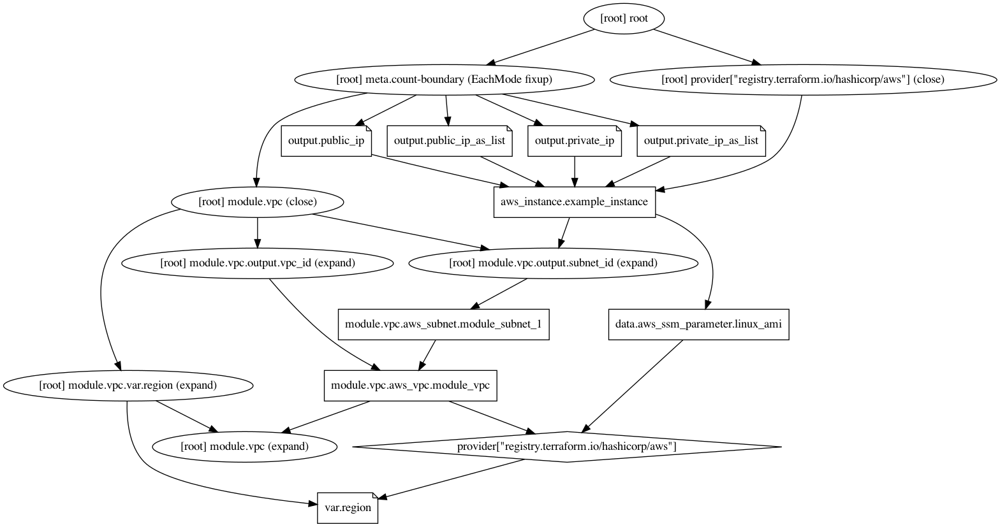

# terraform_workshop day2 lab

## Clone project 
```bash
$ git clone https://github.com/neilkuan/terraform_workshop.git
```

## install provider.
```bash
$ cd day2_lab

$ terraform init
--- example output ---
Initializing modules...
- vpc in modules/vpc

Initializing the backend...

Initializing provider plugins...
- Finding latest version of hashicorp/aws...
- Installing hashicorp/aws v3.41.0...
- Installed hashicorp/aws v3.41.0 (signed by HashiCorp)

Terraform has created a lock file .terraform.lock.hcl to record the provider
selections it made above. Include this file in your version control repository
so that Terraform can guarantee to make the same selections by default when
you run "terraform init" in the future.

Terraform has been successfully initialized!

You may now begin working with Terraform. Try running "terraform plan" to see
any changes that are required for your infrastructure. All Terraform commands
should now work.

If you ever set or change modules or backend configuration for Terraform,
rerun this command to reinitialize your working directory. If you forget, other
commands will detect it and remind you to do so if necessary
```

## To plan
```bash
$ terraform plan
--- example output ---
Terraform used the selected providers to generate the following execution plan. Resource actions are indicated with the following symbols:
  + create

Terraform will perform the following actions:

  # aws_instance.example_instance[0] will be created
  + resource "aws_instance" "example_instance" {
      + ami                                  = (sensitive)
      + arn                                  = (known after apply)
      ...
      ...
      ...
      + owner_id                         = (known after apply)
      + tags                             = {
          + "Name" = "module-vpc"
        }
      + tags_all                         = {
          + "Name" = "module-vpc"
        }
    }

Plan: 4 to add, 0 to change, 0 to destroy.

Changes to Outputs:
  + private_ip         = (known after apply)
  + private_ip_as_list = [
      + (known after apply),
      + (known after apply),
    ]
  + public_ip          = (known after apply)
  + public_ip_as_list  = [
      + (known after apply),
      + (known after apply),
    ]
```

## To deploy 
```bash
$ terraform apply 
--- example output ---
module.vpc.aws_vpc.module_vpc: Creating...
module.vpc.aws_vpc.module_vpc: Still creating... [10s elapsed]
module.vpc.aws_vpc.module_vpc: Creation complete after 16s [id=vpc-07462eb4d263f76de]
module.vpc.aws_internet_gateway.module_gw: Creating...
module.vpc.aws_subnet.module_subnet_1: Creating...
module.vpc.aws_subnet.module_subnet_1: Still creating... [10s elapsed]
module.vpc.aws_subnet.module_subnet_1: Creation complete after 17s [id=subnet-00e023bc74e9628f0]
module.vpc.aws_route_table_association.module_a_igw: Creating...
aws_instance.example_instance[1]: Creating...
aws_instance.example_instance[0]: Creating...
aws_instance.example_instance[0]: Still creating... [10s elapsed]
aws_instance.example_instance[1]: Still creating... [10s elapsed]
aws_instance.example_instance[1]: Still creating... [20s elapsed]
aws_instance.example_instance[0]: Still creating... [20s elapsed]
aws_instance.example_instance[0]: Still creating... [30s elapsed]
aws_instance.example_instance[1]: Still creating... [30s elapsed]
aws_instance.example_instance[1]: Creation complete after 35s [id=i-0a09984e9297a76a0]
aws_instance.example_instance[0]: Creation complete after 35s [id=i-008d0009782d7ab14]

Apply complete! Resources: 4 added, 0 changed, 0 destroyed.

Outputs:

private_ip = "10.0.0.180"
private_ip_as_list = [
  "10.0.0.180",
  "10.0.0.29",
]
public_ip = "35.174.185.127"
public_ip_as_list = [
  "35.174.185.127",
  "34.239.249.185",
]
```



## To destroy 
```bash
$ terraform destroy
--- example output ---
module.vpc.aws_vpc.module_vpc: Refreshing state... [id=vpc-07462eb4d263f76de]
module.vpc.aws_subnet.module_subnet_1: Refreshing state... [id=subnet-00e023bc74e9628f0]
aws_instance.example_instance[0]: Refreshing state... [id=i-008d0009782d7ab14]
aws_instance.example_instance[1]: Refreshing state... [id=i-0a09984e9297a76a0]
[id=r-rtb-08d4202735f8ad28d1080289494]
aws_instance.example_instance[1]: Still destroying... [id=i-0a09984e9297a76a0, 30s elapsed]
aws_instance.example_instance[0]: Still destroying... [id=i-008d0009782d7ab14, 30s elapsed]
aws_instance.example_instance[0]: Destruction complete after 37s
aws_instance.example_instance[1]: Destruction complete after 38s
module.vpc.aws_subnet.module_subnet_1: Destroying... [id=subnet-00e023bc74e9628f0]
module.vpc.aws_subnet.module_subnet_1: Destruction complete after 3s
module.vpc.aws_vpc.module_vpc: Destroying... [id=vpc-07462eb4d263f76de]
module.vpc.aws_vpc.module_vpc: Destruction complete after 2s

Destroy complete! Resources: 4 destroyed.
```

## Gen graph `graph.png`
```bash
terraform graph | dot  -Tpng > graph.png
```
