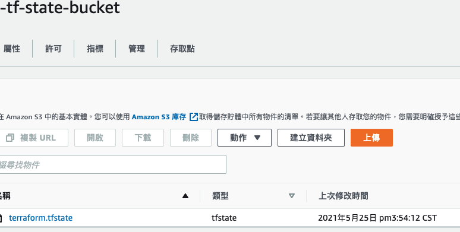

# terraform_workshop day4 lab1-s3-backend use remote s3 state file.

## Clone project 
```bash
$ git clone https://github.com/neilkuan/terraform_workshop.git
```

## install provider
### before init you need to change the `bucket` in `backend.tf` .
```bash
$ cd day4/lab1-s3-backend

$ terraform init
--- example output ---
Initializing modules...

Initializing the backend...

Successfully configured the backend "s3"! Terraform will automatically
use this backend unless the backend configuration changes.

Initializing provider plugins...
- Finding hashicorp/aws versions matching "3.42.0"...
- Installing hashicorp/aws v3.42.0...
- Installed hashicorp/aws v3.42.0 (signed by HashiCorp)

Terraform has created a lock file .terraform.lock.hcl to record the provider
selections it made above. Include this file in your version control repository
so that Terraform can guarantee to make the same selections by default when
you run "terraform init" in the future.

Terraform has been successfully initialized!

You may now begin working with Terraform. Try running "terraform plan" to see
any changes that are required for your infrastructure. All Terraform commands
should now work.

If you ever set or change modules or backend configuration for Terraform,
rerun this command to reinitialize your working directory. If you forget, other
commands will detect it and remind you to do so if necessary.
```

## To plan
```bash
$ terraform plan
--- example output ---
Terraform used the selected providers to generate the following execution plan. Resource actions are indicated with the following symbols:
  + create

Terraform will perform the following actions:

  # module.ec2_with_mandatory_tagging.aws_instance.example will be created
  + resource "aws_instance" "example" {
      + ami                                  = "ami-0ee02acd56a52998e"
    ...
    ...
    ...
  + root_block_device {
          + delete_on_termination = (known after apply)
          + device_name           = (known after apply)
          + encrypted             = (known after apply)
          + iops                  = (known after apply)
          + kms_key_id            = (known after apply)
          + tags                  = (known after apply)
          + throughput            = (known after apply)
          + volume_id             = (known after apply)
          + volume_size           = (known after apply)
          + volume_type           = (known after apply)
        }
    }

Plan: 1 to add, 0 to change, 0 to destroy.
```

## To deploy 
```bash
$ terraform apply 
--- example output ---
module.ec2_with_mandatory_tagging.aws_instance.example: Creating...
module.ec2_with_mandatory_tagging.aws_instance.example: Still creating... [10s elapsed]
module.ec2_with_mandatory_tagging.aws_instance.example: Still creating... [20s elapsed]
module.ec2_with_mandatory_tagging.aws_instance.example: Still creating... [30s elapsed]
module.ec2_with_mandatory_tagging.aws_instance.example: Still creating... [40s elapsed]
module.ec2_with_mandatory_tagging.aws_instance.example: Creation complete after 47s [id=i-0d5bfb89ffa94836b]

Apply complete! Resources: 1 added, 0 changed, 0 destroyed.
```
> after apply, will see your terraform.state file in your backend s3, and you can not see the `terraform.state` in local dir.


## To destroy 
```bash
$ terraform destroy
--- example output ---
module.ec2_with_mandatory_tagging.aws_instance.example: Refreshing state... [id=i-0d5bfb89ffa94836b]
module.ec2_with_mandatory_tagging.aws_instance.example: Destroying... [id=i-0d5bfb89ffa94836b]
module.ec2_with_mandatory_tagging.aws_instance.example: Still destroying... [id=i-0d5bfb89ffa94836b, 10s elapsed]
module.ec2_with_mandatory_tagging.aws_instance.example: Still destroying... [id=i-0d5bfb89ffa94836b, 20s elapsed]
module.ec2_with_mandatory_tagging.aws_instance.example: Still destroying... [id=i-0d5bfb89ffa94836b, 30s elapsed]
module.ec2_with_mandatory_tagging.aws_instance.example: Still destroying... [id=i-0d5bfb89ffa94836b, 40s elapsed]
module.ec2_with_mandatory_tagging.aws_instance.example: Still destroying... [id=i-0d5bfb89ffa94836b, 50s elapsed]
module.ec2_with_mandatory_tagging.aws_instance.example: Destruction complete after 1m0s

Destroy complete! Resources: 1 destroyed.
```